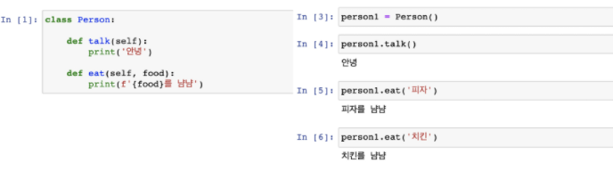
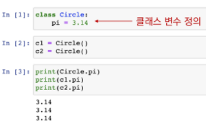
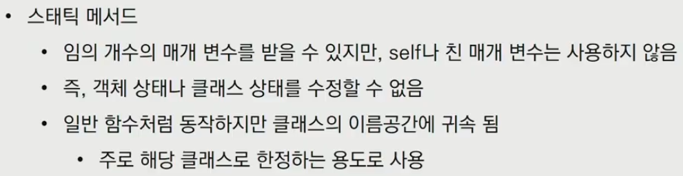
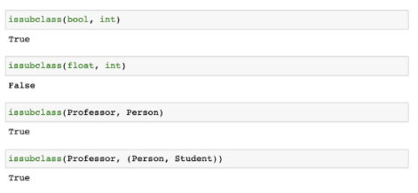
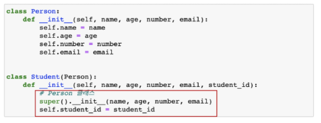
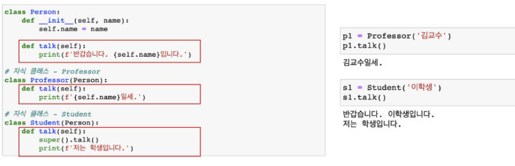

# OOP

## 1. 객체

> Python에서 **모든 것은 객체(object)**입니다.
>
> 모든 객체는 특정 타입의 인스턴스(instance) 이다.
>
> 모든 객체는 **타입(type), 속성(attribute), 조작법(method)**을 가집니다.

* 객체(Object)의 특징
  * **타입(type)**: 어떤 연산자(operator)와 조작(method)이 가능한가?
  * **속성(attribute)**: 어떤 상태(데이터)를 가지는가?
  * **조작법(method)**: 어떤 행위(함수)를 할 수 있는가?


### 타입과 인스턴스

* 타입 : 공통된 속성(attribute)과 조작법(method)을 가진 객체들의 분류
* 인스턴스  
  * 특정 타입(type)의 실제 데이터 예시(instance)입니다.
  * 파이썬에서 모든 것은 객체이고, **모든 객체는 특정 타입의 인스턴스**입니다.

```python
a = 10
b = 20
# a, b 는 객체
# a, b 는 int 타입(type)의 인스턴스
```

* is 연산자 : 객체의 아이엔티티를 검사하는 연산자


* isinstance 함수 : `isinstance(object, classinfo)` 
  * classinfo의 istance거나 subclass인 경우 True
  * classinfo가 tuple인 경우(type으로 구성된) 하나라도 일치하면 True
  * classinfo가 type이거나 type으로 구성되지 않은 경우 TypeError


### 속성과 메서드

| type      | attributes       | methods                                |
| --------- | ---------------- | -------------------------------------- |
| `complex` | `.real`, `.imag` |                                        |
| `str`     | _                | `.capitalize()`, `.join()`, `.split()` |
| `list`    | _                | `.append()`, `.reverse()`, `.sort()`   |
| `dict`    | _                | `.keys()`, `.values()`, `.items()`     |

- 속성(attribute) : 속성은 객체(object)의 상태/데이터

  - `<object>.<attribute>`

    

* 메서드(method) : 특정 객체에 적용할 수 있는 행위를 뜻하며, 일반적으로 클래스에 정의된 함수

  * `<object>.<method>()`

    


## 2. 객체지향 프로그래밍(OOP)

> Object가 중심(oriented)이 되는 프로그래밍

> 객체 지향 프로그래밍(영어: Object-Oriented Programming, OOP)은 컴퓨터 프로그래밍의 패러다임의 하나입니다.
>
> 객체 지향 프로그래밍은 컴퓨터 프로그램을 명령어의 목록으로 보는 시각에서 벗어나 여러 개의 독립된 단위, 즉 "객체"들의 모임으로 파악하고자 하는 것입니다.

​						


* 클래스 `class`: 객체들의 분류(class)를 정의할 때 쓰이는 키워드

* 인스턴스 `instance`: 객체 하나하나의 실체와 예, 인스턴스(instance)를 활용

  

* 속성 : 특정 데이터 타입/클래스의 객체들이 가지게 될 상태/데이터를 의미


* 메서드 : 특정 데이터 타입/클래스의 객체에 공통적으로 적용 가능한 행위(함수)

  

* self : 인스턴스 자기 자신

  * 파이썬에서 인스턴스 메서드는 **호출 시 첫번째 인자로 인스턴스 자신이 전달**되게 설계
  * 매개변수 이름으로 `self`를 첫번째 인자로 정의 (다른이름 가능은 하나 추천안함)

  

* 생성자(constructor) : 인스턴스 객체가 **생성될 때** 호출되는 함수. 반드시 `__init__` 이라는 이름으로 정의.

  

* 소멸자(destructor) : 인스턴스 객체가 **소멸(파괴)되기 직전에** 호출되는 함수. 반드시 `__del__` 이라는 이름으로 정의.

  

* 매직 메서드

  * 더블언더스코어(`__`)가 있는 메서드는 특별한 일을 하기 위해 만들어진 메서드이기 때문에 `스페셜 메서드` 혹은 `매직 메서드`라고 불립니다.

  * 매직(스페셜) 메서드 형태: `__someting__`

  * ```python
    '__str__(self)',
    '__len__(self)',
    '__repr__(self)',
    '__lt__(self, other)',
    '__le__(self, other)',
    '__eq__(self, other)',
    '__ne__(self, other)',
    '__gt__(self, other)',
    '__ge__(self, other)',
    ```

  * 객체의 특수 조작 행위를 지정(함수, 연산자 등)

    * `__str__` : 해당 객체의 출력 형태를 지정
    * `__gt__` : 부등호 연산자(>)
    * 


## 3. 클래스와 인스턴스

### 1) 인스턴스 & 클래스 변수

#### - 인스턴스 변수

- 인스턴스의 속성(attribute)
- 각 인스턴스들의 고유한 변수
- 생성자 메서드에서 `self.<name>`으로 정의
- 인스턴스가 생성된 이후 `인스턴스.변수명`으로 접근 및 할당


#### - 클래스 변수

- 클래스의 속성(attribute)
- 모든 인스턴스가 공유
- 클래스 선언 내부에서 정의
- `클래스.변수명`으로 접근 및 할당




### 2) 인스턴스 & 클래스간의 이름공간

- 클래스를 정의하면, 클래스가 생성됨과 동시에 이름 공간(namespace)이 생성됩니다.

- 인스턴스를 만들게 되면, 인스턴스 객체가 생성되고 해당되는 이름 공간이 생성됩니다.

- 인스턴스의 어트리뷰트가 변경되면, 변경된 데이터를 인스턴스 객체 이름 공간에 저장합니다.

- 즉, 인스턴스에서 특정한 어트리뷰트에 접근하게 되면 **인스턴스 => 클래스** 순으로 탐색을 합니다.


### 3) 메서드의 종류

#### - 인스턴스 메서드(instance method)

- 인스턴스가 사용할 메서드
- 클래스 내부에 정의되는 메서드의 기본값은 인스턴스 메서드
- **호출시, 첫번째 인자로 인스턴스 자기자신 `self`가 전달됩니다**


#### - 클래스 메서드(class method)

- 클래스가 사용할 메서드
- `@classmethod` 데코레이터를 사용하여 정의
- **호출시, 첫 번째 인자로 클래스 `cls`가 전달됩니다**


> @ = 데코레이터 함수 : 잠깐 기능을 추가해줌 

#### - 스태틱 메서드(static method) = 정적 메서드

- 클래스가 사용할 메서드
- `@staticmethod` 데코레이터를 사용하여 정의
- **호출시, 어떠한 인자도 전달되지 않습니다** (클래스 정보에 접근/수정 불가)


-- 인스턴스와 메서드

- 인스턴스는 3가지 메서드 모두에 접근할 수 있습니다.
- 하지만, 인스턴스가 할 행동은 모두 인스턴스 메서드로 한정 지어서 설계합니다.
- 인스턴스에서 클래스 메서드와 스태틱 메서드는 되도록 호출하지 않아야 합니다. (가능하다 != 사용한다)


-- 클래스와 메서드

- 클래스가 할 행동은 다음 원칙에 따라 설계합니다. (클래스 메서드와 정적 메서드)
  - 클래스 자체(`cls`)와 그 속성에 접근할 필요가 있다면 **클래스 메서드**로 정의합니다.
  - 클래스와 클래스 속성에 접근할 필요가 없다면 **정적 메서드**로 정의합니다.
    - 정적 메서드는 `cls`, `self`와 같이 묵시적인 첫번째 인자를 받지 않기 때문


### 추가 설명





## 4. 상속(Inheritance)

* 클래스는 상속이 가능함
* 상속을 통해 객체 간의 관계를 구축
* 부모 클래스의 속성, 메서드가 자식 클래스에 상속되므로 코드 재사용성이 높아짐


* `isinstance(object, classinfo)`
- object가 classinfo의 인스턴스거나 subclass인 경우 True
* `issubclass(class, classinfo)`
  - class가 classinfo의 subclass면 True
  - classinfo는 클래스 객체의 튜플일 수 있으며, classinfo의 모든 항목을 검사



* `super()`
  * 자식클래스에서 부모클래스를 사용하고 싶은 경우




### 메서드 오버라이딩(method overriding)

* 상속 받은 메서드를 재정의
  * 상속받은 클래스에서 같은 이름의 메서드로 덮어씀
  * 부모 클래스의 메서드를 실행시키고 싶은 경우 super를 활용




### 다중 상속

* 두개 이상의 클래스를 상속받는 경우, 다중 상속이 됩니다.

  - 상속 받은 모든 클래스의 요소를 활용 가능

  - 중복된 속성이나 메서드가 있는 경우 상속 순서에 의해 결정

    


