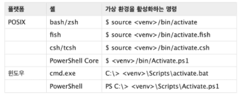

# 모듈
## 1. 모듈과 패키지

* 모듈 : 특정 기능을 `.py` **파일 단위**로 작성한 것.

* 패키지 : 특정 기능과 관련된 여러 **모듈들의 집합**. 패키지 안에는 또다른 서브 패키지를 포함 할수도 있음

* 파이썬 표준 라이브러리 : 파이썬에 **기본적으로 설치된 모듈과 내장 함수**를 묶어서 파이썬 표준 라이브러리 (Python Standard Library, PSL) 라 불림 

* 패키지 관리자(pip) : `PyPI(Python Package Index)` 에 저장된 외부 패키지들을 설치하도록 도와주는 패키지 관리 시스템

  * pip 명령어

    * 패키지 설치 - 최신, 특정, 최소 버전을 명시하여 설치할 수 있음 

      

    * 패키지 삭제 - pip는 패키지를 업그레이드 하는 경우 과거 버전을 자동으로 채워줌

      

    * 패키지 목록 및 특정 패키지 정보

      

    * 패키지 freeze - 설치된 패키지의 비슷한 목록을 만들지만, pip install에서 활용되는 형식으로 출력

      ​						 - 해당하는 목록을 requirements.txt(관습)으로 만들어 관리함

      

    * 패키지 관리하기 - 패키지 목록을 (1)관리하고 (2)설치할 수 있음

      ​							 - 일반적으로 패키지를 기록하는 파일의 이름은 requirements.txt로 정의함

      

      


## 2. 가상환경

> 파이썬 표준 라이브러리가 아닌 외부 패키지와 모듈을 사용하는 경우 모두 pip를 통해 설치 해야함
>
> 복수의 프로젝트를 하는 경우 버전이 상이할 수 있음
>
> 이러한 경우 가상환경을 만들어 프로젝트별로 독립적인 패키지를 관리 할 수 있음

* ####  venv

* 가상 환경을 만들고 관리하는데 사용되는  모듈 (파이썬 3.5부터)

* 특정 디렉토리에 가상 환경을 만들고, 고유한 파이썬 패키지 집합을 가질 수 있음

  * 특정 폴더에 가상환경이(패키지 집합 폴더 등) 있고
  * 실행환경(예- bash)에서 가상환경을 활성화 시켜
  * 해당 폴더에 있는 패키지를 관리/사용함

  

* 가상환경 생성 - 생성하면, 해당 디렉토리에 별도의 파이썬 패키지가 설치됨

  > 폴더명 주로 venv로 사용

  


* 가상환경 활성화/비활성화

  * 활성화 : <venv>는 가상환경을 포함하는 디렉토리의 경로

  
  * 비활성화 :  `$ deactivate` 명령어를 사용
    * cmd와 bash 환경


## 3. 모듈/패키지 활용하기

#### 모듈 만들기 - check

* 짝수 even, 홀수 odd
* 

```python
import check		
check.odd(3)		#True
check.even(3)		#False

from check import odd		#odd함수만 가져옴
from check import *			#전체함수 가져옴
```


#### 패키지

* 패키지는 여러 모듈/하위 패키지로 구조화 (예시- package.module)

* 모든 폴더에는 `__init__.py`를 만들어 패키지로 인식

* 수학과 통계 기능이 들어간 패키지를 아래와 같이 구성

  ​	


> `*`는 권장하지 않음


> 이름이 똑같을 때 as로 이름 바꿀 수 있음


****


